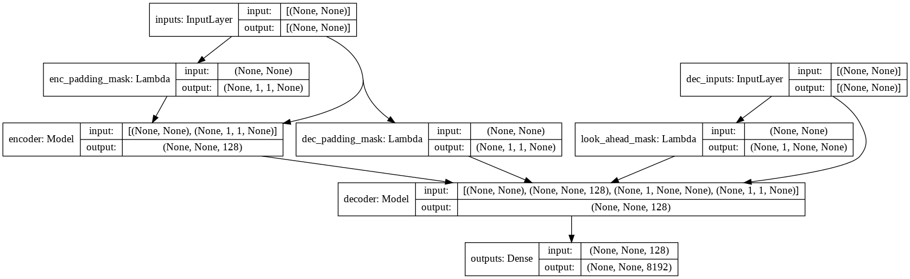

## bot trò chuyện Transformer với TensorFlow 2
Xây dựng một máy trò chuyện end-to-end sử dụng giải thuật [Transformer](https://arxiv.org/abs/1706.03762) trên TensorFlow 2. Hãy xem hướng dẫn của tôi trên [blog.tensorflow.org](https://blog.tensorflow.org/2019/05/transformer-chatbot-tutorial-with-tensorflow-2.html).


### Các gói
- TensorFlow 2.9.1
- [TensorFlow Datasets](https://www.tensorflow.org/datasets).

### Cài đặt
- Tạo môi trường anaconda mới và khởi tạo môi trường `chatbot`
    ```
    conda create -n chatbot python=3.8
    conda activate chatbot
    ```
- Chạy tập lệnh cài đặt
    ```
    sh setup.sh
    ```
- Chú ý: nếu cài đặt trên một hệ thống Linux, tập lệnh sẽ cài đặt CUDA và cuDNN thông qua conda, hoặc `tensorflow-metal` đối với các thiết bị có chip Apple Silicon (Lưu ý rằng có rất nhiều lỗi với TensorFlow trên GPU Apple Silicon, ví dụ như [tối ưu hóa Adam không hoạt động](https://developer.apple.com/forums/thread/691917)).

### Bộ dữ liệu
- Chúng ta sẽ sử dụng các cuộc trò chuyện trong các bộ phim và chương trình truyền hình được cung cấp bởi [Cornell Movie-Dialogs Corpus](https://www.cs.cornell.edu/~cristian/Cornell_Movie-Dialogs_Corpus.html), chứa hơn 220 nghìn trao đổi trò chuyện giữa hơn 10.000 cặp nhân vật phim, là bộ dữ liệu của chúng tôi.
- Chúng tôi tiền xử lý bộ dữ liệu của mình theo thứ tự sau:
	- Trích xuất `max_samples` cặp cuộc trò chuyện thành danh sách các `questions` và `answers`.
	- Tiền xử lý từng câu bằng cách loại bỏ các ký tự đặc biệt trong mỗi câu.
	- Xây dựng tokenizer (ánh xạ văn bản thành ID và ID thành văn bản) bằng cách sử dụng [TensorFlow Datasets SubwordTextEncoder](https://www.tensorflow.org/datasets/api_docs/python/tfds/features/text/SubwordTextEncoder).
	- Mã hóa các câu thành mã thông báo và thêm `start_token` và `end_token` để chỉ định bắt đầu và kết thúc của mỗi câu.
	- Lọc ra các câu có nhiều hơn `max_length` mã thông báo.
	- Thêm mã thông báo cho các câu đã được mã hóa để có độ dài chính xác là `max_length`.
- Kiểm tra [dataset.py](transformer/dataset.py) để biết thêm chi tiết.

### Mô hình

- Kiểm tra [model.py](transformer/model.py) để biết cài đặt Multi-Headed Attention, Positional Encoding và Transformer.

### Chạy
- Kiểm tra tất cả các cờ và siêu tham số có sẵn `python main.py --help`
```
python train.py --output_dir runs/save_model --batch_size 256 --epochs 50 --max_samples 50000
```
- Mô hình đã được đào tạo cuối cùng sẽ được lưu vào `runs/save_model`.

### Mẫu
```
input:		where have you been?
output:		i m not talking about that .

input:		it's a trap!
output:		no , it s not .
```